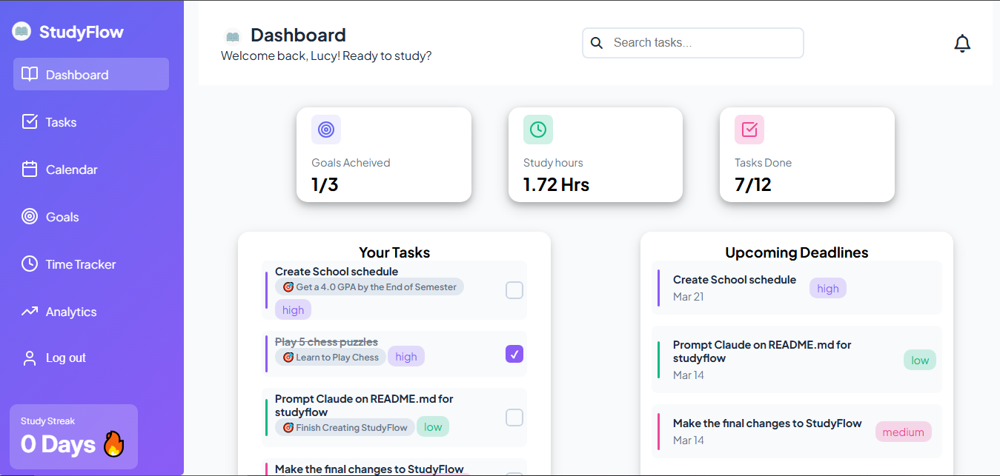
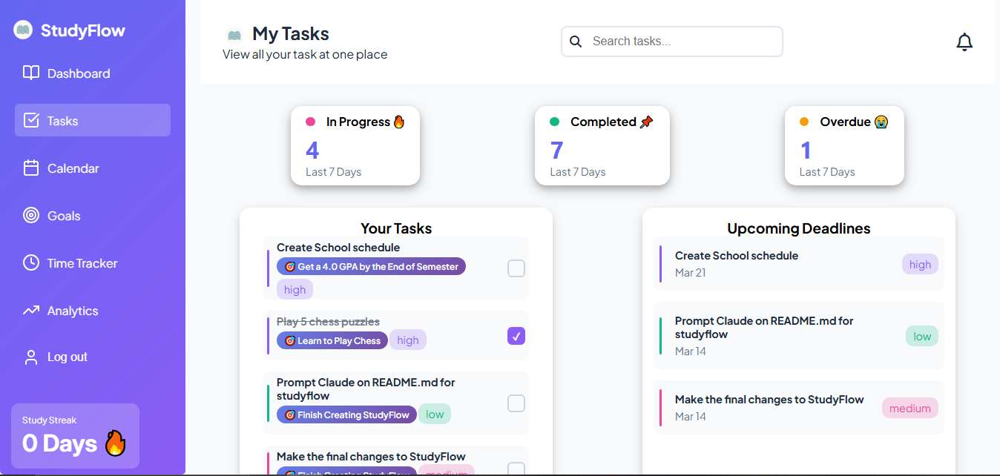
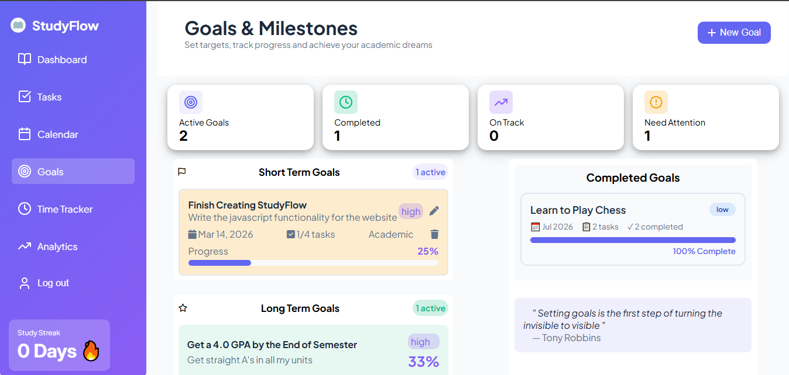
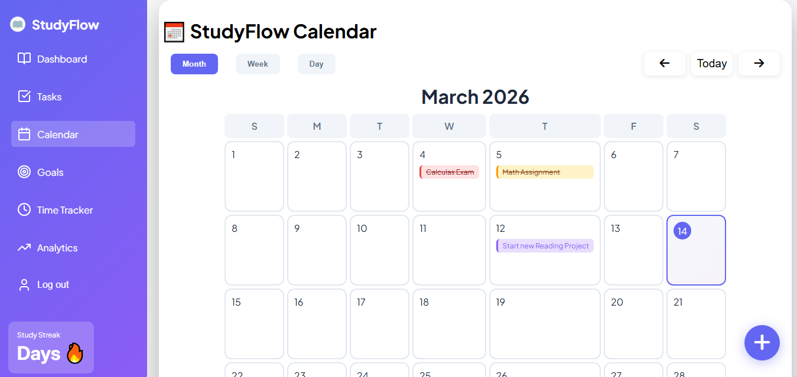
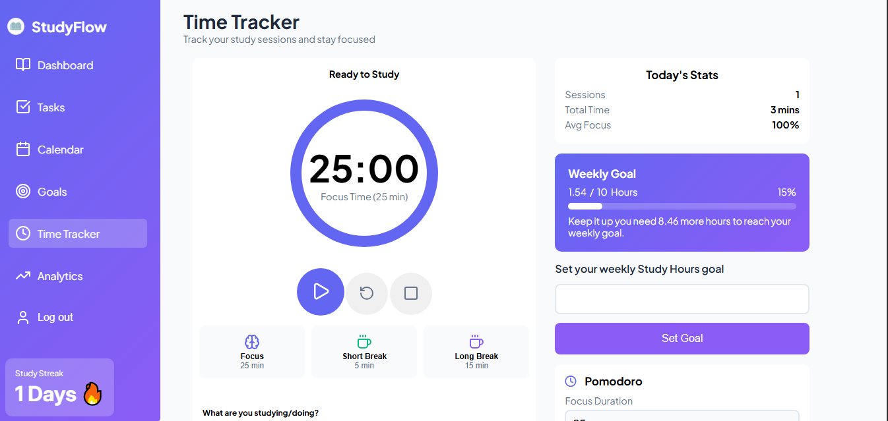
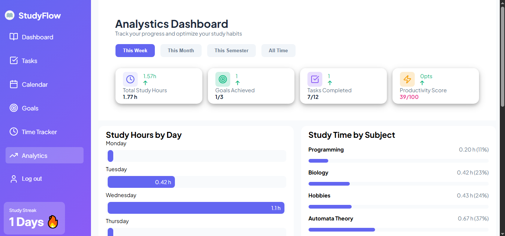

# StudyFlow 📚

**The all-in-one productivity suite designed specifically for the modern student.**

Master your schedule. Find your Flow.

---

## 🎯 About StudyFlow

StudyFlow is a comprehensive task and goal management application built for students who want to take control of their academic life. It combines task tracking, goal setting, calendar management, and study session tracking into one intuitive platform.

### Why StudyFlow?

- **Stop Overwhelming:** Centralize tasks from all your classes in one place
- **Beat Procrastination:** Integrated Pomodoro timers and focus modes to keep you on track
- **Visual Progress:** Track your progress and see your to-dos building up to real accomplishments

---

## ✨ Features

### 📊 Dashboard

- Get a complete overview of your academic progress
- View tasks due today and upcoming deadlines
- Track completed tasks and study hours
- Monitor your study streak



### ✅ Task Management
- Create tasks with titles, subjects, priorities, and deadlines
- Link tasks to specific goals
- Categorize tasks by type
- Filter tasks by status (in-progress, completed, overdue)
- Mark tasks as complete and track progress



### 🎯 Goal Tracking
- Set and manage academic goals
- Link tasks directly to your goals
- Monitor goal progress through task completion



### 📅 Calendar View
- Visualize your tasks on an interactive calendar
- See deadlines at a glance
- Plan your schedule effectively



### ⏱️ Study Tracker
- Built-in Pomodoro timer for focused study sessions
- Track study hours and sessions
- Monitor your productivity patterns
- Build and maintain study streaks



### 📈 Analytics
- View detailed progress reports
- Analyze your study patterns
- Track productivity trends over time
- Visual charts and statistics



### 🔐 Authentication
- Secure user registration and login
- Password management and reset functionality
- Persistent session management

---

## 🛠️ Tech Stack

### Frontend
- **HTML5** - Semantic markup
- **CSS3** - Modern responsive styling with custom design system
- **JavaScript (ES6+)** - Dynamic interactivity and logic
- **Font Awesome** - Icon library

### Backend & Database
- **Supabase** - Backend as a Service (BaaS)
- **PostgreSQL** - Cloud database via Supabase
- **Authentication** - Supabase Auth

### Styling
- **Custom CSS** - Responsive design with CSS variables
- **Google Fonts** - Plus Jakarta Sans and Inter font families
- **Color Scheme** - Modern indigo, purple, and green palette

---

## 📁 Project Structure

```
StudyFlow/
├── index.html              # Landing page
├── login.html              # User login page
├── register.html           # User registration page
├── updatePassword.html     # Password reset page
├── dashboard.html          # Main dashboard view
├── tasks.html              # Task management interface
├── goals.html              # Goal tracking interface
├── calendar.html           # Calendar view
├── tracker.html            # Study session tracker
├── analytics.html          # Progress analytics
├── styles.css              # Global styling
├── JS/
│   ├── supabase_init.js   # Supabase configuration
│   ├── script.js           # Shared utilities
│   ├── login_register.js   # Authentication logic
│   ├── dashboard.js        # Dashboard functionality
│   ├── tasks.js            # Task management logic
│   ├── goals.js            # Goal tracking logic
│   ├── calendar.js         # Calendar functionality
│   ├── tracker.js          # Study tracker logic
│   └── analytics.js        # Analytics functionality
└── Images/
    ├── bookOpenIcon.png    # App logo
    ├── dashboard-mockup.png
    └── [Profile images]
```

---

## 🚀 Getting Started

### Prerequisites
- Modern web browser (Chrome, Firefox, Safari, Edge)
- Internet connection
- Supabase account (configured with database schema)

### Installation

1. **Clone or download the project**
   ```bash
   git clone <repository-url>
   cd StudyFlow
   ```

2. **Open the application**
   - Open `index.html` in your web browser
   - Or deploy to a web server

3. **Configure Supabase (if needed)**
   - Update Supabase credentials in `JS/supabase_init.js`
   - Ensure your database schema includes: users, tasks, goals, study_sessions tables

### Using StudyFlow

1. **Create an Account**
   - Click "Start for Free" on the landing page
   - Fill in your registration details
   - Verify your email

2. **Set Up Your Profile**
   - Log in with your credentials
   - Configure your dashboard

3. **Start Tracking**
   - Create your first task in the Tasks section
   - Set goals you want to achieve
   - Use the Pomodoro timer while studying
   - Monitor your progress in Analytics

---

## 🎨 Design System

StudyFlow uses a modern, cohesive design system with:

- **Primary Color:** Indigo (#6366f1)
- **Secondary Color:** Purple (#8b5cf6)
- **Accent Colors:** Pink, Green, Orange, Blue
- **Typography:** Plus Jakarta Sans (headings), Inter (body)
- **Responsive Layout:** Mobile-first design approach

---

## 🔄 Key Workflows

### Adding a Task
1. Navigate to Tasks page
2. Click "Add Task" button
3. Fill in task details (title, subject, priority, deadline)
4. Optionally link to a goal
5. Submit to save

### Study Sessions
1. Go to Tracker page
2. Start Pomodoro timer
3. Focus for 25-minute intervals
4. System logs your study hours and maintains your streak

### Monitoring Progress
1. Check Dashboard for daily overview
2. Visit Analytics for detailed progress reports
3. Review Calendar for upcoming deadlines

---

## 📱 Responsive Design

StudyFlow is fully responsive and works seamlessly on:
- Desktop computers
- Tablets
- Mobile devices

---

## 🔒 Security

- Supabase authentication ensures secure user data
- Password hashing and encryption
- Session-based authentication
- Protected routes (auth guard checks)

---

## 📝 Features Roadmap

Future enhancements may include:
- Collaborative study groups
- Mobile app (React Native/Flutter)
- AI-powered study recommendations
- Integration with calendar services (Google Calendar, Outlook)
- Study statistics export
- Dark mode
- Custom themes

---

## 🐛 Troubleshooting

### Can't log in?
- Check your internet connection
- Verify Supabase is accessible
- Clear browser cache and cookies
- Reset your password if forgotten

### Tasks not saving?
- Check browser console for errors
- Verify Supabase API key is correct
- Ensure database tables exist

### Page loading slowly?
- Check internet speed
- Clear browser cache
- Try a different browser
- Check Supabase service status

---

## 📧 Support

For issues or feature requests, please contact the development team.

---

## 👨‍💻 Contributing

Contributions are welcome! Please follow these steps:
1. Fork the repository
2. Create a feature branch
3. Commit your changes
4. Push to the branch
5. Submit a pull request

---

**Built with ❤️ for students, by students**

Master your schedule. Find your Flow. 🚀
